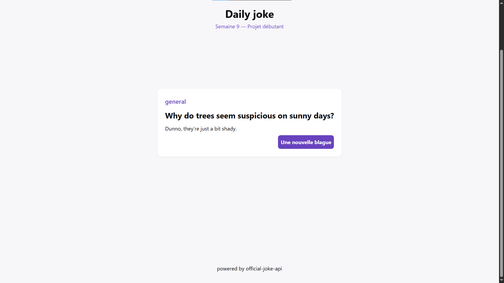
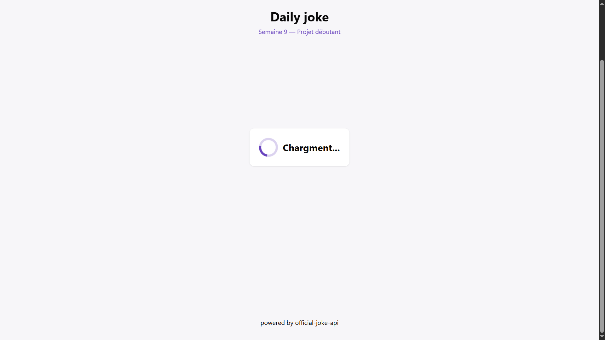
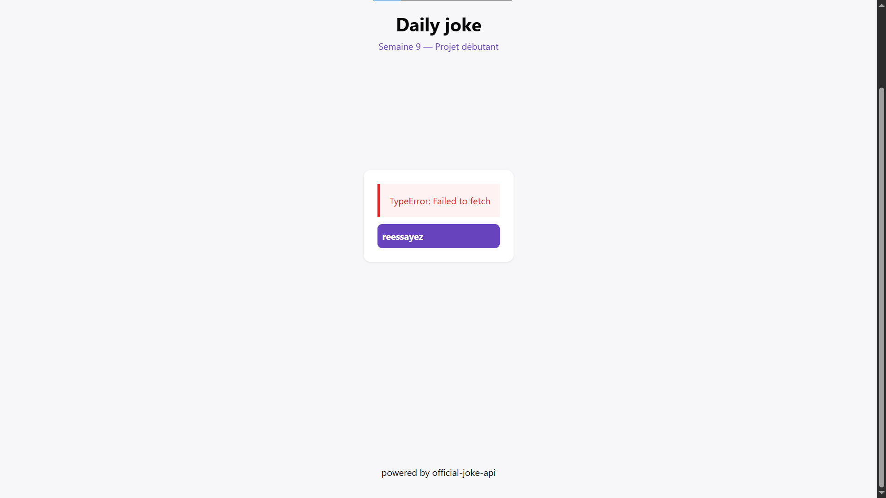

# projet9.1-blague-au-hazard

# Overview

projet d'affichage de blague. il s'agit d'une interface simple sur laquelle on arrive et on rit d'une blague choisis au hazard

# interface

voici les différentes interfaces que vous pouvez rencontrez sur la plateforme

## 1. accueil

## 2. chargement

## 3. erreur

# technologie utilisé

1. **html:** structure semantique des differentes affichages
2. **css**: stylisation
3. js: interaction avec l'api et injection des differentes interfaces
4. **official-joke-api**: api fournissant les differentes blagues.
